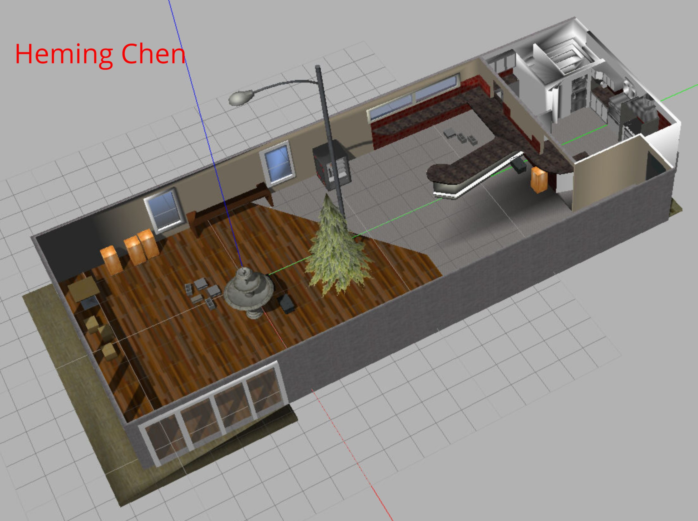
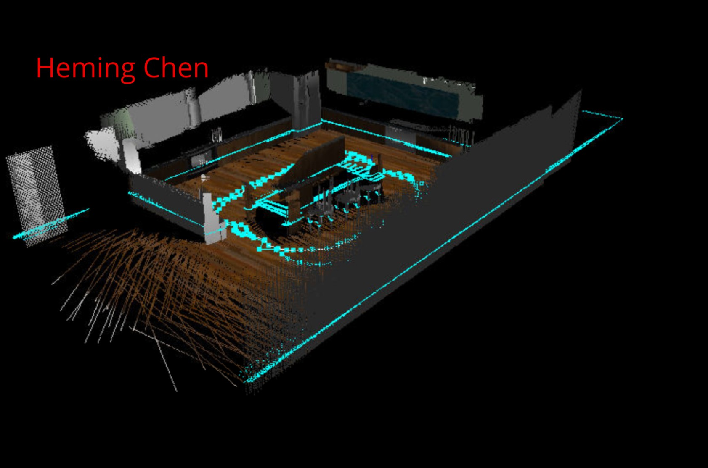
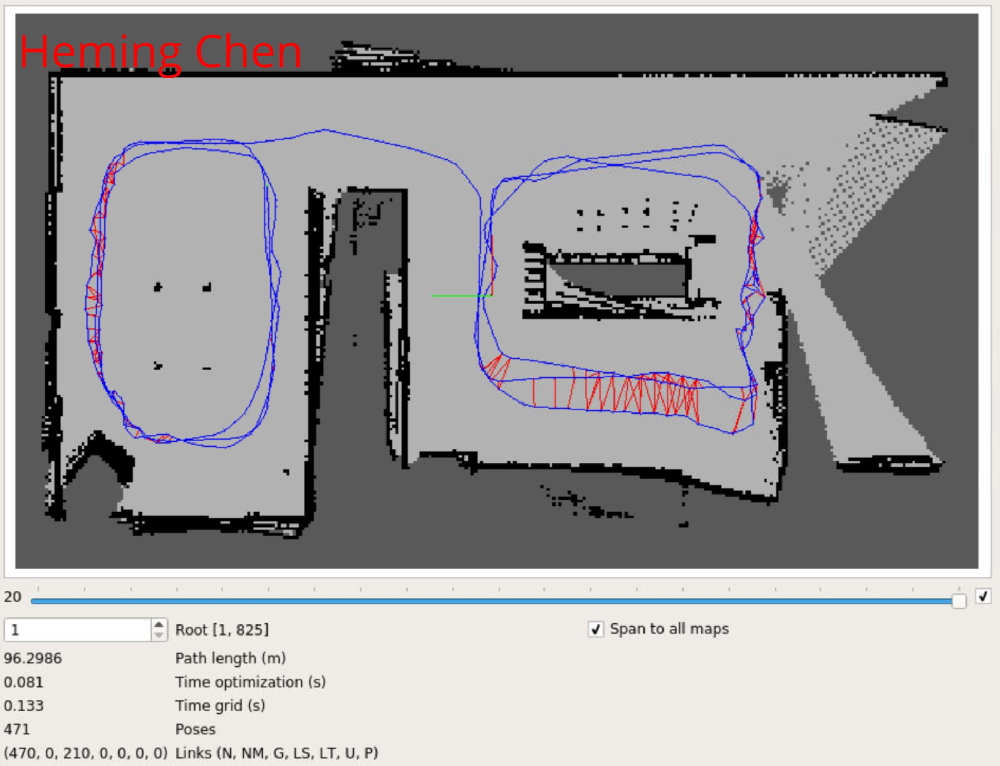
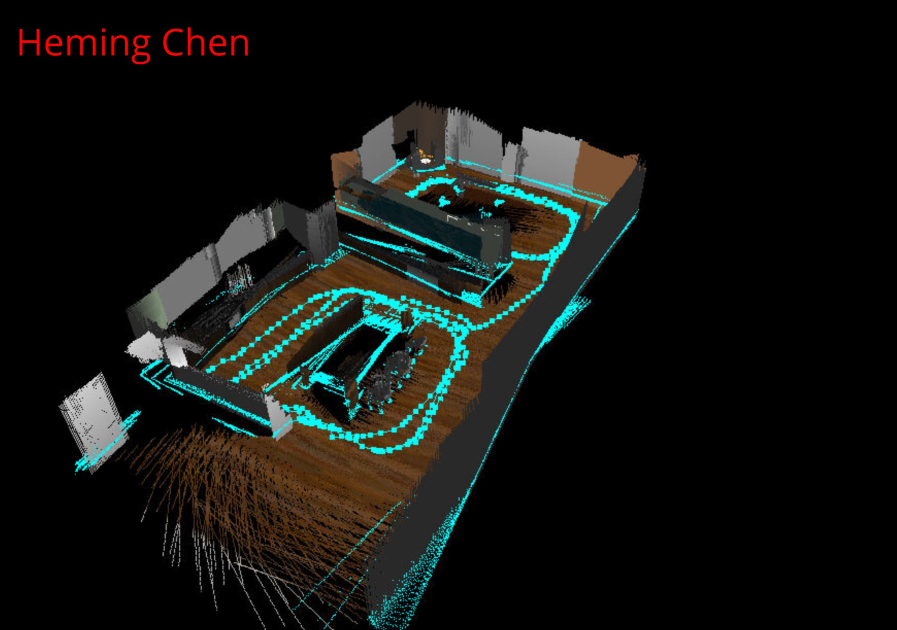

[](https://www.udacity.com/robotics)


# Robotic Map My World Robot Project

## Abstract
The goal of this project is run the Simultaneous Localization and Mapping (SLAM) algorithm with the custom robot created in prior project, both in a Udacity provided virtual world and a custom world. To achieve it, the RGB camera in the custom robot needs to be replaced by a RGB-D in order to provide depth information. We also need to assemble an ROS package to accommodate robots, worlds, and all supporting files including launch scripts. Upon completion, the 2D and 3D maps of the two worlds should be generated by using the RTAB-Map technique.

The ROS package source code can be found in the `slam_project` folder. Maps of the two worlds are stored in `rtab_db` folder. This README file is the writeup that is also available in PDF format.

## Introduction
All prior projects assume that the robot will perform its duties, such as localization, in an environment with a map known to the robot. However, it is not always the case in reality. First of all, it is difficult to acquire an accurate map of a big environment for all applications. Surveying a big complex environment and make an accurate 2D/3D map can be very expensive, which may not be affordable to most people/companies. On the other hand, most complex environment in real-world changes all the time. Hence pursuing an accurate and compete map of the entire environment often becomes meaningless. For example, while running a known road, a self-driving car still has to deal with all kinds of moving objects that changes every second, such as pedestrians and other cars. As a result, in most cases, the robotic system will have to be able to operate in a dynamic environment, during which SLAM is most likely needed.

In this project, the robot will generate 2D and 3D map and localize itself using the RTAB-Map approach both in an Udacity provided virtual world and a custom world previously not known to the robot. The main goal is the make as fewer passes as possible to generate at least 3 loop closures.

## Background
In the area of localization, common methods include Kalman Filter (including EKF, Unscented KF, etc.) and Particle Filter.

### Occupancy Grid Mapping
Unlike SLAM algorithms, the occupancy grid mapping method assumes that the robot pose is known. Its main idea is to represent the world as a uniformly spaced grid, where each cell contains a random variables representing the probability that cell is occupied/obstacle. This nature makes this method suitable for navigation and trajectory planning, which can be difficult to do with SLAM.

SLAM on the other hand assumes that the map is unknown to the robot and simultaneously localizes the robot and maps the world. It is fundamentally much more challenging than Occupancy Grid Mapping. While using SLAM, the accuracy of the map and the localization depend on each other. Hence if one fails to deliver satisfying result the other will also be affected. SLAM takes two forms, online SLAM and full SLAM. Online SLAM estimates the current pose of the robot and map using the present measurements and controls. Full SLAM, or offline SLAM, estimates the robot’s complete trajectory and map using all measurements and control. While both solve for the full SLAM, only one solves the online SLAM problem.

### Grid-based FastSLAM
The basic idea of FastSLAM is to preserve a set of particles to approximate a posterior over the trajectory. It uses low dimensional EKF (Extended Kalman Filter) to solve independent features of the map, which are modeled with a local Gaussian. Because FastSLAM estimates the robot’s full path, this technique solves the full SLAM problem. However, each particle in FastSLAM approximates the robot’s immediate pose, thus this technique also solves the online SLAM problem.

FastSLAM has two types. First type includes FastSLAM 1.0 and 2.0, which are iterative upgrades of the FastSLAM algorithm. The other type is an extension of the FastSLAM algorithm, called Grid-based FastSLAM. The biggest disadvantage of FastSLAM is that it always assumes known landmarks exist on the map, which prevents it from modeling an random environment. This however is not a problem for Grid-based FastSLAM, which keeps the biggest advantage of FastSLAM - using particle filter to solve the localization problem, but extends the algorithm to occupancy grid maps. Grid mapping algorithm can model the environment using grid maps without predefining any landmark hence solves the fundamental issue with FastSLAM.

### GraphSLAM
GraphSLAM addresses the full SLAM problem by estimating the entire path of the robot and the map. Advantages of GraphSLAM include less demanding on onboard processing power and better accuracy than FastSLAM. Since FastSLAM uses randomly generated particles to estimate robot pose, it is possible to find no particle at the most likely position of robot. Due to the limited number of particles, this occurs more often in large environments. GraphSLAM on the other hand can work with all data at once to find the optimal solution. GraphSLAM is also simple to understand. It interprets the data as a set of constraints represented by a graph, and then solves for the optimal estimation of robot path and map while satisfying these constraints.

In this project, RTAB-Map (Real-Time Appearance-Based Mapping), a GraphSLAM method, is used. RTAB-Map utilizes depth camera data to localize the robot and map the environment in real time. It also uses the so called loop closure method to determine a robot has seen a location before and therefore enhance the accuracy of the map. RTAB-Map is good for large-scale and long-term SLAM by using multiple strategies to allow loop closure to be done in real-time. 


## Robot Setup
The custom robot has a cylinder-shape chassis with a dome on top. The camera is mounted on front of the cylinder chassis and the laser scanner is installed on the top of the dome. It has two wheels in the middle section of the chassis and two casters - one in front and one in the back, to maintain balance. 

In this project, the RGB camera is replaced by a RGB-D camera, which provides depth information to RTAB-Map algorithm to help conduct SLAM. The laser range scanner is kept on the robot but not used for SLAM.

Robot specs and screenshot are given below.

| Component          | Shape    | Size         |
|:------------------:|:--------:|:------------:|
| chassis            | Cylinder | R=0.25 L=0.15|
| dome               | Sphere   | R=0.1        |
| wheel              | Cylinder | R=0.05 L=0.05|
| caster             | Sphere   | R=0.025      |


The updated custom robot model xacro file is given blow.
```xml
<?xml version='1.0'?>
<robot name="udacity_bot"
    xmlns:xacro="http://www.ros.org/wiki/xacro">
    <xacro:include filename="$(find slam_project)/urdf/udacity_bot.gazebo"/>
    <link name="robot_footprint"></link>
    <joint name="robot_footprint_joint" type="fixed">
        <origin xyz="0 0 0" rpy="0 0 0"/>
        <parent link="robot_footprint"/>
        <child link="chassis"/>
    </joint>
    <!-- Left wheel -->
    <joint type="continuous" name="left_wheel_hinge">
        <origin xyz="0 0.15 0" rpy="0 0 0"/>
        <child link="left_wheel"/>
        <parent link="chassis"/>
        <axis xyz="0 1 0" rpy="0 0 0"/>
        <limit effort="10000" velocity="1000"/>
        <dynamics damping="1.0" friction="1.0"/>
    </joint>
    <link name='left_wheel'>
        <inertial>
            <mass value="5.0"/>
            <origin xyz="0.0 0 0" rpy=" 0 1.5707 1.5707"/>
            <inertia
          ixx="0.1" ixy="0" ixz="0"
          iyy="0.1" iyz="0"
          izz="0.1"
      />
        </inertial>
        <collision name='left_wheel_collision'>
            <origin xyz="0 0 0" rpy=" 0 1.5707 1.5707"/>
            <geometry>
                <cylinder radius="0.05" length="0.05"/>
            </geometry>
        </collision>
        <visual name='left_wheel_visual'>
            <origin xyz="0 0 0" rpy=" 0 1.5707 1.5707"/>
            <geometry>
                <cylinder radius="0.05" length="0.05"/>
            </geometry>
        </visual>
    </link>
    <!-- Right wheel -->
    <joint type="continuous" name="right_wheel_hinge">
        <origin xyz="0 -0.15 0" rpy="0 0 0"/>
        <child link="right_wheel"/>
        <parent link="chassis"/>
        <axis xyz="0 1 0" rpy="0 0 0"/>
        <limit effort="10000" velocity="1000"/>
        <dynamics damping="1.0" friction="1.0"/>
    </joint>
    <link name='right_wheel'>
        <inertial>
            <mass value="5.0"/>
            <origin xyz="0.0 0 0" rpy=" 0 1.5707 1.5707"/>
            <inertia
          ixx="0.1" ixy="0" ixz="0"
          iyy="0.1" iyz="0"
          izz="0.1"
      />
        </inertial>
        <collision name='right_wheel_collision'>
            <origin xyz="0 0 0" rpy=" 0 1.5707 1.5707"/>
            <geometry>
                <cylinder radius="0.05" length="0.05"/>
            </geometry>
        </collision>
        <visual name='right_wheel_visual'>
            <origin xyz="0 0 0" rpy=" 0 1.5707 1.5707"/>
            <geometry>
                <cylinder radius="0.05" length="0.05"/>
            </geometry>
        </visual>
    </link>
    <!-- Camera -->
    <joint type="fixed" name="camera_joint">
        <origin xyz="0.275 0 0.1" rpy="0 0 0"/>
        <child link="camera"/>
        <parent link="chassis"/>
    </joint>
    
    <link name="camera_rgbd_frame"></link>
    <joint name="camera_rgbd_joint" type="fixed">
        <origin rpy="-${pi/2} 0 -${pi/2}"/>
        <parent link="camera"/>
        <child link="camera_rgbd_frame"/>
    </joint>
    
    <link name='camera'>
        <inertial>
            <mass value="0.1"/>
            <origin xyz="0.0 0 0" rpy=" 0 0 0"/>
            <inertia
          ixx="1e-6" ixy="0" ixz="0"
          iyy="1e-6" iyz="0"
          izz="1e-6"
      />
        </inertial>
        <collision name='camera_collision'>
            <origin xyz="0 0 0" rpy=" 0 0 0"/>
            <geometry>
                <box size="0.05 0.05 0.05"/>
            </geometry>
        </collision>
        <visual name='camera_visual'>
            <origin xyz="0 0 0" rpy=" 0 0 0"/>
            <geometry>
                <box size="0.05 0.05 0.05"/>
            </geometry>
        </visual>
    </link>
    <!-- Laser scanner -->
    <joint type="fixed" name="hokuyo_joint">
        <origin xyz="0 0 0.20" rpy="0 0 0"/>
        <child link="hokuyo"/>
        <parent link="chassis"/>
    </joint>
    <link name='hokuyo'>
        <inertial>
            <mass value="0.1"/>
            <origin xyz="0.0 0 0" rpy=" 0 0 0"/>
            <inertia
          ixx="1e-6" ixy="0" ixz="0"
          iyy="1e-6" iyz="0"
          izz="1e-6"
      />
        </inertial>
        <collision name='hokuyo_collision'>
            <origin xyz="0 0 0" rpy=" 0 0 0"/>
            <geometry>
                <box size="0.1 0.1 0.1"/>
            </geometry>
        </collision>
        <visual name='hokuyo_visual'>
            <origin xyz="0 0 0" rpy=" 0 0 0"/>
            <geometry>
                <mesh filename="package://slam_project/meshes/hokuyo.dae"/>
            </geometry>
        </visual>
    </link>
    <!-- Chassis -->
    <link name='chassis'>
        <pose>0 0 0.1 0 0 0</pose>
        <inertial>
            <mass value="15.0"/>
            <origin xyz="0.0 0 0" rpy=" 0 0 0"/>
            <inertia
          ixx="0.1" ixy="0" ixz="0"
          iyy="0.1" iyz="0"
          izz="0.1"
      />
        </inertial>
        <!--<collision name='collision'>-->
        <!--<origin xyz="0 0 0" rpy=" 0 0 0"/>-->
        <!--<geometry>-->
        <!--<box size=".4 .2 .1"/>-->
        <!--</geometry>-->
        <!--</collision>-->
        <!--<visual name='chassis_visual'>-->
        <!--<origin xyz="0 0 0" rpy=" 0 0 0"/>-->
        <!--<geometry>-->
        <!--<box size=".4 .2 .1"/>-->
        <!--</geometry>-->
        <!--</visual>-->
        <collision name='chassis_collision'>
            <origin xyz="0 0 0.05" rpy=" 0 0 0"/>
            <geometry>
                <cylinder radius="0.25" length="0.15"/>
            </geometry>
        </collision>
        <visual name='chassis_visual'>
            <origin xyz="0 0 0.05" rpy=" 0 0 0"/>
            <geometry>
                <cylinder radius="0.25" length="0.15"/>
            </geometry>
        </visual>
        <collision name='chassis_dome_collision'>
            <origin xyz="0 0 0.1125" rpy=" 0 0 0"/>
            <geometry>
                <sphere radius="0.1"/>
            </geometry>
        </collision>
        <visual name='chassis_dome_visual'>
            <origin xyz="0 0 0.1125" rpy=" 0 0 0"/>
            <geometry>
                <sphere radius="0.1"/>
            </geometry>
        </visual>
        <collision name='back_caster_collision'>
            <origin xyz="-0.15 0 -0.025" rpy=" 0 0 0"/>
            <geometry>
                <sphere radius="0.02499"/>
            </geometry>
        </collision>
        <visual name='back_caster_visual'>
            <origin xyz="-0.15 0 -0.025" rpy=" 0 0 0"/>
            <geometry>
                <sphere radius="0.025"/>
            </geometry>
        </visual>
        <collision name='front_caster_collision'>
            <origin xyz="0.15 0 -0.025" rpy=" 0 0 0"/>
            <geometry>
                <sphere radius="0.02499"/>
            </geometry>
        </collision>
        <visual name='front_caster_visual'>
            <origin xyz="0.15 0 -0.025" rpy=" 0 0 0"/>
            <geometry>
                <sphere radius="0.025"/>
            </geometry>
        </visual>
    </link>
</robot>
```

The robot model gazebo file is given blow.
```xml
<?xml version="1.0" encoding="UTF-8"?>
<robot>
    <gazebo>
        <plugin name="differential_drive_controller" filename="libgazebo_ros_diff_drive.so">
            <legacyMode>false</legacyMode>
            <alwaysOn>true</alwaysOn>
            <updateRate>10</updateRate>
            <leftJoint>left_wheel_hinge</leftJoint>
            <rightJoint>right_wheel_hinge</rightJoint>
            <wheelSeparation>0.4</wheelSeparation>
            <wheelDiameter>0.2</wheelDiameter>
            <torque>10</torque>
            <commandTopic>cmd_vel</commandTopic>
            <odometryTopic>odom</odometryTopic>
            <odometryFrame>odom</odometryFrame>
            <robotBaseFrame>robot_footprint</robotBaseFrame>
        </plugin>
    </gazebo>
    <!-- RGBD Camera -->
    <gazebo reference="camera">
        <material>Gazebo/Red</material>
        <sensor type="depth" name="camera1">
            <always_on>1</always_on>
            <update_rate>20.0</update_rate>
            <visualize>true</visualize>
            <camera>
                <horizontal_fov>1.047</horizontal_fov>
                <image>
                    <width>640</width>
                    <height>480</height>
                    <format>R8G8B8</format>
                </image>
                <depth_camera />
                <clip>
                    <near>0.1</near>
                    <far>20</far>
                </clip>
            </camera>
            <plugin name="camera_controller" filename="libgazebo_ros_openni_kinect.so">
                <alwaysOn>true</alwaysOn>
                <updateRate>10.0</updateRate>
                <cameraName>camera</cameraName>
                <frameName>camera_rgbd_frame</frameName>
                <imageTopicName>rgb/image_raw</imageTopicName>
                <depthImageTopicName>depth/image_raw</depthImageTopicName>
                <pointCloudTopicName>depth/points</pointCloudTopicName>
                <cameraInfoTopicName>rgb/camera_info</cameraInfoTopicName>
                <depthImageCameraInfoTopicName>depth/camera_info</depthImageCameraInfoTopicName>
                <pointCloudCutoff>0.4</pointCloudCutoff>
                <hackBaseline>0.07</hackBaseline>
                <distortionK1>0.0</distortionK1>
                <distortionK2>0.0</distortionK2>
                <distortionK3>0.0</distortionK3>
                <distortionT1>0.0</distortionT1>
                <distortionT2>0.0</distortionT2>
                <CxPrime>0.0</CxPrime>
                <Cx>0.0</Cx>
                <Cy>0.0</Cy>
                <focalLength>0.0</focalLength>
            </plugin>
        </sensor>
    </gazebo>
    <!-- hokuyo -->
    <gazebo reference="hokuyo">
        <sensor type="ray" name="head_hokuyo_sensor">
            <pose>0 0 0 0 0 0</pose>
            <visualize>false</visualize>
            <update_rate>40</update_rate>
            <ray>
                <scan>
                    <horizontal>
                        <samples>720</samples>
                        <resolution>1</resolution>
                        <min_angle>-1.570796</min_angle>
                        <max_angle>1.570796</max_angle>
                    </horizontal>
                </scan>
                <range>
                    <min>0.10</min>
                    <max>30.0</max>
                    <resolution>0.01</resolution>
                </range>
                <noise>
                    <type>gaussian</type>
                    <!-- Noise parameters based on published spec for Hokuyo laser
               achieving "+-30mm" accuracy at range < 10m.  A mean of 0.0m and
               stddev of 0.01m will put 99.7% of samples within 0.03m of the true
               reading. -->
                    <mean>0.0</mean>
                    <stddev>0.01</stddev>
                </noise>
            </ray>
            <plugin name="gazebo_ros_head_hokuyo_controller" filename="libgazebo_ros_laser.so">
                <topicName>/scan</topicName>
                <frameName>hokuyo</frameName>
            </plugin>
        </sensor>
    </gazebo>
</robot>
```

## Virtual World Setup
This project requires the robot to SLAM in both a Udacity provided virtual world and a custom virtual world.

### Udacity World
The Udacity provided environment is a kitchen-dining space consists of 3 segments - an unoccupied small space, a kitchen space and a dining space. The robot needs to go over each space multiple times to generate enough loop closures and create an accurate map of the environment. A screenshot is given below.


### Custom World
The custom environment is built upon the `cafe` model that comes with `Gazebo`. Some small to mid sized objects are added, such as cabinets, concrete blocks, boxes, etc., to create more features for robot to capture during mapping. A screenshot is given below.




## Results
Due to GitHub file size limitation, 3D maps are stored on Google Drive:
- Udacity World: [https://drive.google.com/open?id=1GsDOWM_8uCr7S7-9capPgnE_01mhtFZj](https://drive.google.com/open?id=1GsDOWM_8uCr7S7-9capPgnE_01mhtFZj)
- Custom World: [https://drive.google.com/open?id=1XrC8AQsxMM1olh_99rtqWe3pbNhfI_ye](https://drive.google.com/open?id=1XrC8AQsxMM1olh_99rtqWe3pbNhfI_ye)

### Udacity World
It took the robot 3 loops around the "kitchen-dining" world to generate a satisfying map. It turned out the best way was to map one room completely for 3 loops and then move onto the next room. Switching between rooms at each loop sometimes could confuse the `RTAB-Map` algorithm, possibly due to lack of features in the hall way.

During the mapping, robot's linear speed was increased to `~0.4` and angular speed remained the default value `1.0`. The screenshots below present the SLAM process.

First, run 3 loops in the kitchen area:

| Loop 1                                        | Loop 2                                          | Loop 3                                          |
:----------------------------------------------:|:-----------------------------------------------:|:-----------------------------------------------:
 |  |  

Then, drive the robot to the dining area and run another 3 loops:

| Loop 1                                        | Loop 2                                          | Loop 3                                          |
:----------------------------------------------:|:-----------------------------------------------:|:-----------------------------------------------:
  |   |  

The completed maps for Udacity virtual world are

| 2D Map                                        | 3D Map                                          |
:----------------------------------------------:|:-----------------------------------------------:
   | 

As in above picture, a total of 210 loop global loop closures were detected during SLAM.


### Custom World
Due to the simpler setup, it took the robot 2 loops to get an OK map for the custom world, and 3 loops for a decent one. Due to the drastic change of the flooring between the two segments of the custom world, the robot only mapped the area with dark wood flooring. Somehow switching between two areas at each loop would confuse the `RTAP-Map` algorithm and make the surveyed map unusable. 

During the mapping, robot's linear speed was increased to `~0.35` and angular speed remained the default value `1.0`.

The robot made 3 loops near the "wood flooring" area:

| Loop 1                              | Loop 2                                | Loop 3                                |
:------------------------------------:|:-------------------------------------:|:-------------------------------------:
 |  |  

The completed maps for custom virtual world are

| 2D Map                                        | 3D Map                                          |
:----------------------------------------------:|:-----------------------------------------------:
   | 

As in above picture, a total of 165 loop global loop closures were detected during SLAM.


## Discussion
In general, mapping both virtual worlds were successful. Mapping in 2D was relatively easier, a decent 2D map could be generated after 1 or 2 passes at moderate travel speed. 

Generating good 3D map however took more passes and demanded slower travel speed for more smooth, continuous data flow. This was especially important when mapping a relatively complex environment, such as the kitchen world.

It occurred to me that rotating the robot in place would cause the mapping node to continuously throw warnings about insufficient inliers and disrupt the generated 3D map. It was possibly due to robot not having liner speed and `RTAB-Map` was confused. Minimizing rotating movements (`J` and `L` key in `teleop`) seemed to solve the problem.

Another lesson learned was that the mount position and angle of the depth camera could also affect SLAM performance. The depth camera on my custom robot is mounted to a relatively low position hence cannot see tall objects if too close. It affected the mapping speed. Solution was to not travel too close to tall feature rich objects so as to catch more features in fewer passes.


## Future Work
I would like try a different robot design with camera mounted a little higher. The virtual world could also be easier to map if more features or objects can be added. The default selections of objects in `Gazebo` are quite limited for building a complex virtual world. I will try getting more models from other custom worlds available online. The last thing would be duplicating the SLAM environment on my Linux PC locally, as opposed to using the Udacity Workspace, which can be really slow at some times, especially when running a large virtual world.


## How to use
This repository has to run in Udacity Workspace VM and was not tested on local VM.

### Clone and run it
Clone repo and copy `slam_project` to `/home/workspace/catkin_ws/src`. Then, compile the code:
```bash
cd /home/workspace/catkin_ws
catkin_make
```

Before running the package, please note somehow collision was not enabled in my copy of Udacity supplied world file, hence the robot can go through all objects making SLAM not working. On the Slack channel, a solution was offered by other students - run the following script to enable collision, which has also been added to the beginning of `rtab_run` script:
```bash
curl -L https://s3-us-west-1.amazonaws.com/udacity-robotics/Term+2+Resources/P3+Resources/models.tar.gz | tar zx -C ~/.gazebo/
``` 

Now, open a terminal window and run:
```bash
cd /home/workspace/catkin_ws
source devel/setup.bash
cd src/slam_project
./rtab_run
```

At the first prompt, enter `y` to remove previous map. Then either enter `d` to launch the Udacity world, or enter `/home/workspace/catkin_ws/src/slam_project/worlds/myworld.world` to launch the custom world that comes with this repository.

Once `Gazebo` is up and running, go back to the first terminal window and hit any key to start mapping. More terminal windows will then pop up. From there on, we can control the robot in the terminal running the `teleop` node and map the world.

To stop mapping, we HAVE TO hit `ctrl+c` to terminate the mapping node, which upon shutting down will print that map has been saved to hard drive. Simply closing the mapping node terminal window WILL NOT save the map, hence `rtabmap-databaseViewer` will also show an empty map.